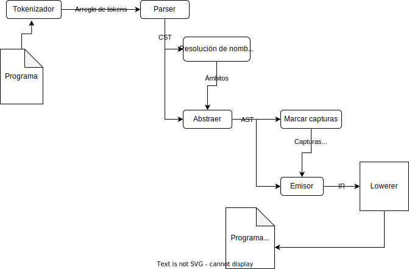

# Arquitectura del compilador #

Este compilador tiene una arquitectura bastante sencilla, siendo parcialmente
un query-compiler y parcialmente un batch-compiler.

El diagrama indica que:

  * Todo comienza con el programa.
  * El programa es procesado por el tokenizador, obteniendo un arreglo de
    tokens.
  * El parser consume este arreglo de tokens y produce un CST (*Concrete Syntax
    Tree*).
  * La resolución de nombres opera sobre este CST, anotándolo con información
    sobre los nombres y los ámbitos.
  * El *abstractor* abstrae el CST y produce un AST (*Abstract Syntax Tree*).
  * El pase de marcar capturas opera sobre el AST, anotándolo con información
    sobre las capturas de los closures y las variables locales.
  * El emisor consume el AST y emite el IR (*Intermediate Representation*).
  * El lowerer consume el IR y emite el código en C.

## Tokenizador y parser ##

El [tokenizador](../pdc/tokenizador.pd) toma un programa como entrada,
extrayendo sus [tokens](../pdc/tokens.pd). El [parser](../pdc/parser.pd) toma
esta secuencia de tokens y produce un [CST](../pdc/cst.pd).

El parser esta hecho con una biblioteca de
[combinadores](../pdc/combinadores.pd).

## Resolución de nombres ##

El pase de [resolución de nombres](../pdc/nombres.pd) anota este CST con
información de cada ámbito y cada binding. Un binding es un identificador único
para cada variable de un módulo. Cada ámbito del programa es *cosificado* [^1]
en una clase `Ámbito` y asociado a su respectivo nodo del CST. Similarmente,
este pase lleva registro de que variables son *autoejecutables*

## Abstractor ##

[Este pase](../pdc/abstraer.pd) abstrae el CST, convirtiéndolo en un
[AST](../pdc/ast.pd).

## Marcar capturas ##

[Este pase](../pdc/capturas.pd) anota cada función del AST con información
sobre que bindings captura y que bindings son locales. Esta información será
vital más adelante cuando compilemos el programa.

## Emisor y lowerer ##

Este pase está dividido en dos archivos:
[`pdc/backend/c.pd`](../pdc/backend/c.pd) y
[`pdc/backend/c/ir.pd`](../pdc/backend/c/ir.pd).

El primero compila el AST al IR, el segundo contiene las estructuras de datos
del IR.

### El IR ###

El IR esta basado en [tuplas](https://cs.lmu.edu/~ray/notes/squid/), donde cada
instrucción es una tupla cuyo primer elemento es el opcode y los demás son los
argumentos.

[^1]: Del inglés *reify*.
