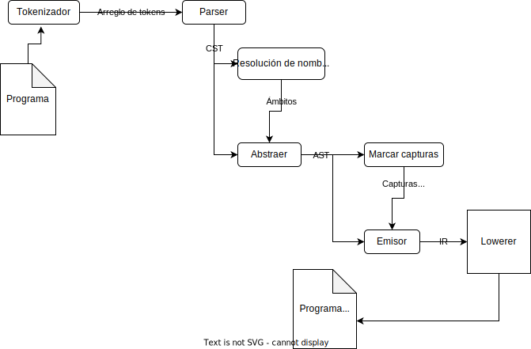

# Arquitectura del compilador #

Este compilador tiene una arquitectura bastante sencilla, siendo parcialmente
un query-compiler y parcialmente un batch-compiler.

El diagrama indica que:

  * Todo comienza con el programa.
  * El programa es procesado por el tokenizador, obteniendo un arreglo de
    tokens.
  * El parser consume este arreglo de tokens y produce un CST (*Concrete Syntax
    Tree*).
  * La resolución de nombres opera sobre este CST, anotándolo con información
    sobre los nombres y los ámbitos.
  * El *abstractor* abstrae el CST y produce un AST (*Abstract Syntax Tree*).
  * El pase de marcar capturas opera sobre el AST, anotándolo con información
    sobre las capturas de los closures y las variables locales.
  * El emisor consume el AST y emite el IR (*Intermediate Representation*).
  * El lowerer consume el IR y emite el código en C.

## Tokenizador y parser ##

El [tokenizador](../pdc/tokenizador.pd) toma un programa como entrada,
extrayendo sus [tokens](../pdc/tokens.pd). El [parser](../pdc/parser.pd) toma
esta secuencia de tokens y produce un [CST](../pdc/cst.pd).

El parser está hecho con una biblioteca de
[combinadores](../pdc/combinadores.pd).

## Resolución de nombres ##

El pase de [resolución de nombres](../pdc/nombres.pd) anota este CST con
información de cada ámbito y cada binding. Un binding es un identificador único
para cada variable de un módulo. Cada ámbito del programa es *cosificado* [^1]
en una clase `Ámbito` y asociado a su respectivo nodo del CST. Similarmente,
este pase lleva registro de que variables son *autoejecutables*

[^1]: Del inglés *reify*.

## Abstractor ##

[Este pase](../pdc/abstraer.pd) abstrae el CST, convirtiéndolo en un
[AST](../pdc/ast.pd).

## Marcar capturas ##

[Este pase](../pdc/capturas.pd) anota cada función del AST con información
sobre que bindings captura y que bindings son locales. Esta información será
vital más adelante cuando compilemos el programa.

## Emisor y lowerer ##

Este pase está dividido en dos archivos:
[`pdc/backend/c.pd`](../pdc/backend/c.pd) y
[`pdc/backend/c/ir.pd`](../pdc/backend/c/ir.pd).

El primero compila el AST al IR, el segundo contiene las estructuras de datos
del IR.

### El IR ###

El IR está basado en [tuplas](https://cs.lmu.edu/~ray/notes/squid/), donde cada
instrucción es una tupla cuyo primer elemento es el opcode y los demás son los
argumentos.

## Otras cosas ##

[`pdc/dependencias.pd`](../pdc/dependencias.pd) extráe las dependencias de un
módulo de forma que el compilador pueda verificar que todos los módulos
importados exísten antes de continuar con la compilación.

[`pdc/validación.pd`](../pdc/validación.pd) contiene un par de funciones que
verifican ciertos aspectos del lenguaje (como que no hay ningún `devolver` fuera
de una función, etc.).

## El runtime ##

La segunda mitad del proyecto es el runtime en C (o *pdcrt*) que provee las
funciones, tipos de datos y macros necesarias para ejecutar los programas
emitidos por el compilador.

El código del runtime se encuentra en el directorio [`runtime/c/pdcrt`](../runtime/c/pdcrt).
El runtime contiene una parte que está escrita en PseudoD y es cargada al inicio de cada
programa. Esta es [`runtime/c/runtime.pd`](../runtime/c/runtime.pd).

El runtime está conceptualmente inspirado por el runtime de
[CHICKEN Scheme](https://call-cc.org/). Específicamente en el uso de un
recolector de basura del tipo *Cheney on the MTA* (véase
[CHICKEN internals: the garbage collector](https://www.more-magic.net/posts/internals-gc.html),
[A guide to the CHICKEN compilation process](https://wiki.call-cc.org/chicken-compilation-process)
y por supuesto también
[CONS should not CONS its arguments, part II: Cheney on the M.T.A.](https://dl.acm.org/doi/10.1145/214448.214454)
por el mismísimo Henry G. Baker). Algunas diferencias notables con
CHICKEN Scheme es que este usa *pointer tagging* para representar los
valores de Scheme[^2] mientras que PseudoD utiliza *punteros gordos*
(de forma similar a la implementación ENative del lenguaje E, véase
[Fat Pointers](http://erights.org/enative/fatpointers.html)). Cada
puntero gordo ocupa 128-bits y es almacenado en 2 variables de 64-bits
(véase la estructura `pdcrt_obj`) o un registro SIMD (`__m128i`).

[^2]: [CHICKEN internals: data representation](https://www.more-magic.net/posts/internals-data-representation.html)
